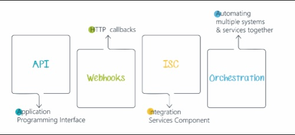

🌿 Botanical Weather Station & Monitoring Dashboard
A modern React application designed to bridge the gap between meteorological data and botanical research. This tool performs real-time data transformation on weather API responses to provide ecological insights and 24-hour climate trends.

🚀 Technical Highlights
Modern Frontend Stack: Built using React 19, Vite, and Recharts for high-performance data visualization.

Client-Side ETL: Implemented data transformation logic to map complex, nested JSON from OpenWeatherMap into flat time-series objects for trend analysis.

Domain-Driven Logic: Developed a Botanical Insight module that applies scientific logic (temperature/humidity thresholds) to real-time data to assist in specimen monitoring.

CI/CD Pipeline: Configured GitHub Actions for automated build verification and continuous integration.

Secrets Management: Orchestrated secure environment variable handling using .env for local development and cloud-based secrets for deployment.

🛠️ Components
SearchBar.jsx: Handles user input and triggers asynchronous API calls.

WeatherCard.jsx: Displays current conditions with dynamic CSS that responds to the weather state.

WeatherChart.jsx: A data-viz component showing the 24-hour temperature trend using SVG-based charting.

BotanicalInsight.jsx: Provides researcher-focused notes based on ecological thresholds.

🧪 Scientific Application
This project was built with a focus on Ecological Forecasting. By monitoring variables like humidity and temperature trends, researchers can predict periods of high fungal risk or thermal stress in tropical plant specimens.
